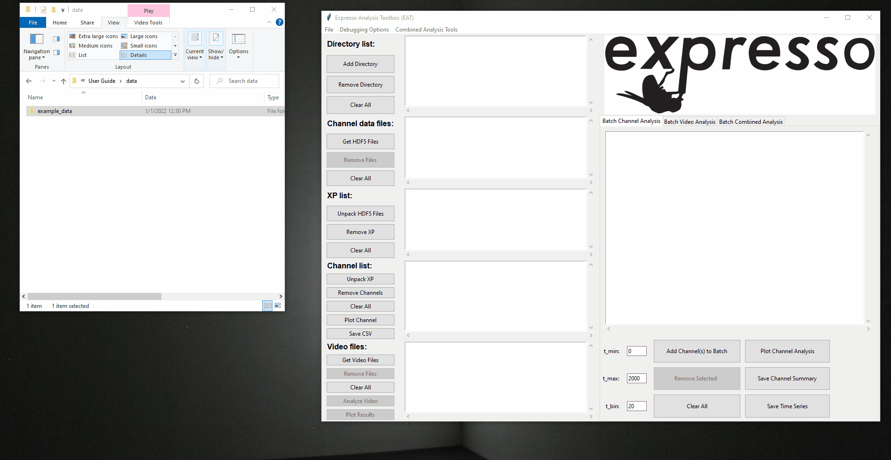
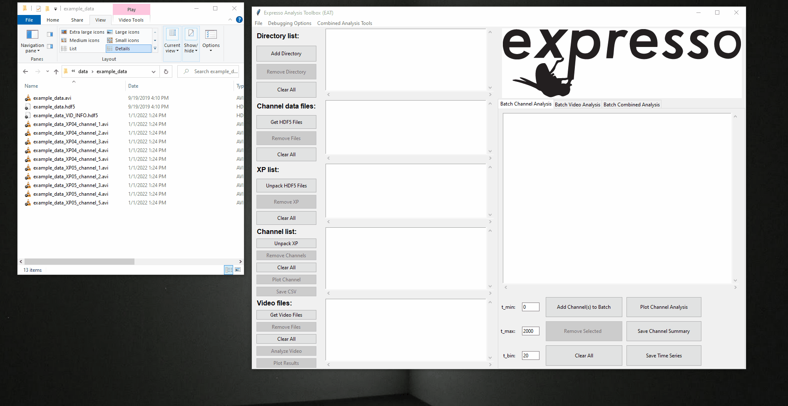
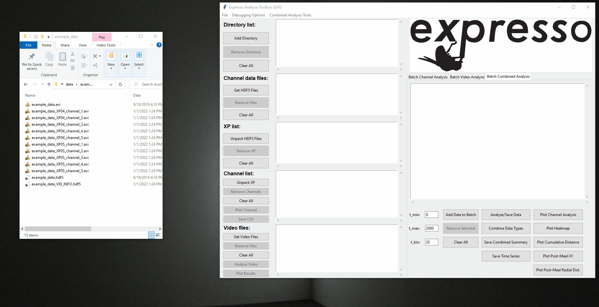
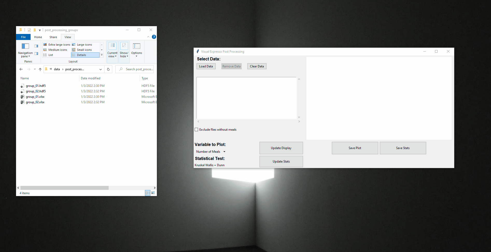
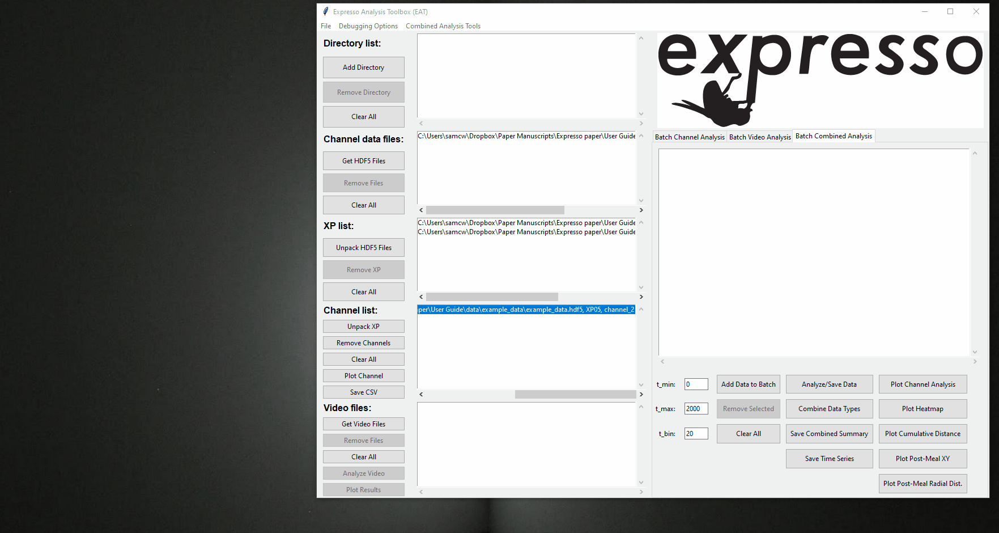
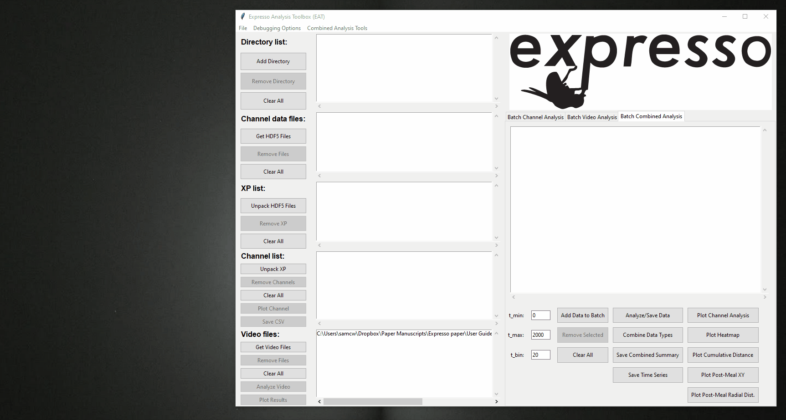
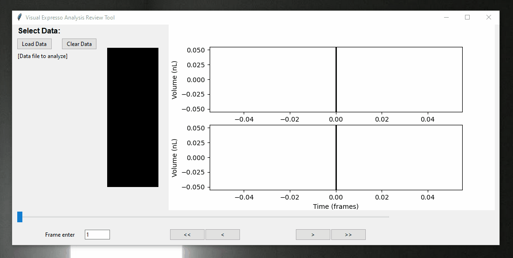

# EXPRESSO ANALYSIS TOOLBOX (EAT) USER GUIDE #

**E**xpresso **A**nalysis **T**oolbox (EAT) is a Python toolbox for analyzing data from Expresso behavioral assays, in which the food consumption of individual *Drosophila* is monitored on the nanoliter scale (described in [Yapici et al., 2016](https://doi.org/10.1016/j.cell.2016.02.061)). In addition to high-resolution food intake measurements, EAT facilitates the analysis of simultaneously captured motion tracking data, allowing a multi-faceted analysis of Drosophila feeding and foraging behavior. The source code for EAT can be found on GitHub ([here](https://github.com/scw97/EAT)), and an example of this combined feeding/tracking analysis can be seen in our forthcoming manuscript [TBD](http://yapicilab.com/research-projects.html).

For installation and assay setup information, see the repository [README](https://github.com/scw97/EAT/edit/master/README.md) file.

## Overview ##

In a typical run of the Visual Expresso assay, the user will collect both feeding and video data via the Expresso banks and an external camera, respectively. Feeding data is saved in .hdf5 format, while video data is typically saved in .avi format. The goals of EAT are to identity meal bouts within the feeding data, track the fly's position using the video data, and synthesize these two data types for combined analyses.

The following is a rough outline of the steps used to achieve these goals, which we will expand upon in subsequent sections:

1. Preprocess raw video data to obtained cropped video files containing single flies, with the tip of the food capillary located manually.
2. Perform combined meal bout detection and tracking analysis on each fly.
3. Examine groupwise statistics for movement/eating variables.

Note that EAT can be used to analyze feeding and video data separately, but is best used when both are available. 

## Video preprocessing ##

The video data collected in our Visual Expresso experiments consists of overhead footage of two Expresso banks, each containing five channels. Thus, while feeding data is collected and stored at the per-fly level, video data typically contains multiple flies in frame. To match up feeding and tracking data, the video preprocessing GUI (`crop_and_save_gui.py`) allows the user to manually identify ROIs to generate per-fly video files, as well as determine the capillary tip location in each video and estimate the convertion from pixels to centimeters. 

Each Expresso bank has an assigned name --- e.g. "XP04" --- and the channels within each bank are numbered 1--5. Each individual fly in an experimental run can thus be identified by its combination of bank name and channel number, e.g. XP04/channel_1. For a video from an experimental run --- let's call it `example_data.avi` --- we'll use the preprocessing GUI to produce a series of video files of the form:
*  `example_data_XP04_channel_1.avi`
*  `example_data_XP04_channel_2.avi`
*  ...
*  `example_data_XP05_channel_1.avi`
*  ...

This process also generates a `example_data_VID_INFO.hdf5` file containing information on the cropping ROIs, pixel to cm conversion, etc. 

To perform video pre-processing, first open the preprocessing GUI by running **`crop_and_save_gui.py`** (either via the command line or a IDE like Spyder, as in the [README](https://github.com/scw97/EAT/blob/master/README.md) file). Then do the following:

1. **Load videos for preprocessing into the GUI.** This can be accomplished in one of two ways:  
    * Click the \<Add Directory> button to locate and select directories 	containing video files for preprocessing. Then highlight desired directories in the "Directory list" box and click \<Get Video Files> to populate the "Detected files" box with all video files located within the selected directories.
    * Drag and drop videos files directly into the "Detected files" box. (It is also possible to drag and drop directories in the "Directory list" box and click \<Get Video Files> to populate the "Detected files").
 
2. **Select videos to preprocess.** Videos are selected by highlighting them within the "Detected files" box and clicking \<Add Video(s) to Batch> (located underneath the "Batch analyze list" box). This should populate the "Batch analyze list" box with the selected videos

3. **Enter Expresso banks names and channel numbers.** As mentioned above, each Expresso bank has a string identifier (e.g. "XP04") and a set number of channels --- this information should be stored in the same .hdf5 output file that contains the feeding data. For the video(s) you'd like to preprocess, enter the bank names and channel numbers into the "Bank 1 Name," "Bank 1 Channels," "Bank 2 Name," and "Bank 2 Channels" text fields, which channel numbers separated by columns. Ensure that all videos in the "Batch analyze list" box have the same bank names and channel numbers because, in subsequent steps, the preprocessing pipeline will ask you to identify the ROI for (Bank 1)/(Channel 1), (Bank 1)/(Channel 2), ..., (Bank 2)/(Channel 1), (Bank 2)/(Channel 2), ...

4. **Begin manual preprocessing input.** Click \<Process Videos> to begin. A single frame from the first video in the "Batch analyze list" box will then open, and you will be prompted to perform several tasks:
    * Define the ROI for (Bank 1)/(Channel 1) by drawing a rectangle with the mouse (left click and drag) and pressing Enter. This ROI should include the full region of space that the fly is able to move in; this will necessarily include the capillary tip, whose location is manually identified in a subsequent step. **Important:**  the ROI highlighted in the video **must** correspond to (Bank 1)/(Channel 1) in the Expresso .hdf5 feeding data output --- we recommend adding bank name and channel numbers to the filming area to avoid ambiguity. 
    * Identify the capillary tip location for the (Bank 1)/(Channel 1) video. After defining the first ROI, a new window should open with a single frame showing only the ROI. Using this, double click on the location of the capillary tip and press Enter. NB: Estimates of capillary location can be edited later using the \<Refine Tip Estimate> button in the same preprocessing GUI.
    * Draw lines corresponding to the vial length and width in the (Bank 1)/(Channel 1) ROI. You will be prompted to draw these two lines --- one for the vial length and one for the vial width --- separately. For each line, left click and drag the mouse cursor to draw the corresponding line on the cropped image and press enter to continue. These two distances within the image --- measured in pixels --- are then matched with stored values for the real-world lengths in centimeters to obtain the pixel/cm conversion factor. To update the real-world vial length measurements, change these values in the `v_expresso_gui_params.py` file (`vial_length_cm` and `vial_width_cm` in the `trackingParams` dictionary object).
    * Repeat the first two steps (drawing ROI and identifying capillary tip) for the remaining bank and channel combinations: (Bank 1)/(Channel 2), ..., (Bank 2)/(Channel 1), (Bank 2)/(Channel 2), ... Note that the vial dimensions only need to be measured once
    

After each bank/channel combination has had an ROI and capillary tip location defined, new cropped video files will be generated corresponding to each fly. These will be used in subsequent steps to extract fly body tracking data. At this point the video pre-processing GUI window can be closed, although you can use the File dropdown menu and select the "Open Main GUI" option to open the GUI interface used in the following section.

## Feeding and tracking analyses ##

Having preprocessed our video data such that we know have an individual video file for each fly, we can now use the main EAT GUI to extract information about fly meal bouts, movement, etc. To begin, run **`visual_expresso_gui_main.py`**, which loads an instance of the main EAT GUI window. The following steps will walk through the use of this GUI.

### Importing data ###
To analyze data with EAT, we first need to import it into the GUI. This can be accomplished in one of several ways: 
* Click the \<Add Directory> button and use it to select a folder containing Visual Expresso data --- this will populate the "Directory list" box. From there, highlight a directory (or set of directories) and click either \<Get HDF5 Files> or \<Get Video Files> to populate the "Channel data files" or "Video files" boxes. In the case of "Video files," this box will be populated with cropped .avi files, as generated from the preprocessing steps described in the previous section. In the case of "Channel data files," this box will be populated by .hdf5 files containing liquid level data output by the Expresso system. To access individual fly data from these .hdf5 files, use the \<Unpack XP> button to populate the 'XP list' box with the list of Expresso banks in the selected .hdf5 files and the \<Unpack XP> button to populate the "Channel list" box with individual fly channels (see GIF below). 
* Follow the same steps as above, but drag and drop folders into the "Directory list" box.
* Drag and drop .hdf5 files directly into the "Channel data files" box. Use the same steps as above to subdivide into bank and channel information. 
* Drag and drop cropped .avi files directly into the "Video files" box.

To assist in the populating of the different data type list boxes, the options under the "Combined Analysis Tools" dropdown menu can be used to synchronize the contents of the "Channel list" and "Video files" boxes via either set union or intersection, as well as to match selected (highlighted) entries.

### Analyzing single channels ###

After populating the "Channel list" box, the buttons to its left can be used to analyze data from single flies. In particular, we can generate time series plots of liquid level with detected meal bouts indicated (\<Plot Channel>) or save meal bout information --- e.g. meal start, stop, duration, and volume --- in .csv format (\<Save CSV>) for a selected "Channel list" entry:

### Analyzing single videos ###

After populating the "Video files" box, the buttons to its left can be used to perform video tracking (\<Analyze Video>) and plot various kinematic parameters (\<Plot Results>). NB: tracking results are saved automatically in .hdf5 format with the filename suffix "_TRACKING" or "_TRACKING\_PROCESSED." 

### Batch analyses ###

To analyze data from multiple flies at once, we use the batch analysis window on the righthand side of the main EAT GUI. The tabs on the top left of this window correspond to batch analysis of 1) just liquid level data ("Batch Channel Analysis), 2) just video data ("Batch Video Analysis"), and 3) combined liquid level and video data ("Batch Combined Analysis"). We'll discuss only the "Batch Combined Analysis" here, as it is typically the default, and since the analyses of single data types mirror the options available for combined data. 

#### Selecting files for batch analysis ####
To begin batch analysis, we need to populate the batch analysis list box. To do this, highlight of entries in either the "Channel list" or "Video files" box and click the \<Add Data to Batch> button. Underneath the batch analysis list box are three columns containing buttons, as well as a column of input fields on the lefthand side. The input fields are used solely as time limits and bin sizes for plots of feeding --- they will not affect the output of any saved analyses. The leftmost column of buttons deals with populating the batch analysis list box (adding entries as described above, as well as removing some or all entries). The more functionally useful buttons are found in the center and rightmost columns.

#### Analyzing/saving multi-fly data ####
The central column of batch analysis buttons contains tools for analyzing multiple flies at once, as well as saving the results of these analyses for future use. To perform both tracking and meal bout detection on data files in the batch analysis list box, use the \<Analyze/Save Data> button. This will generate a .hdf5 analysis file for each entry in the batch analysis list box, which are automatically saved to the directory where the corresponding list box entry can be found. Files generated with this method have the suffix "_COMBINED\_DATA." If the entries in the batch analysis list box have already been tracked --- and there exist "\*\_TRACKING\_PROCESSED	.hdf5" files for these entries --- then the \<Combine Data Types> button can also be used to generate "_COMBINED\_DATA.hdf5" files, without needing to repeat the tracking calculations. 

With combined data analysis files in hand, the \<Save Combined Summary> and \<Save Time Series> buttons can be used to save information on multiple flies (those populating the batch analysis list box). \<Save Combined Summary> generates both .hdf5 and .xlsx files containing per-fly data on meal events and tracking summaries. NB: the files produced by \<Save Combined Summary> are the input for the EAT data visualization GUI, which facilitates groupwise plotting and statistical comparisons for selected feeding and movement variables. \<Save Time Series> generates a series of .csv files --- one for each entry in the batch analysis list box --- containing information about the fly at each measured time point, including the (x,y) position, speed, and a boolean signal indicating whether or not the fly is currently feeding at that time point. These .csv files are meant to provide an easier means for accessing the time series data, both for manual examination and input into other analysis tools. 

#### Plotting batch results ####
The rightmost column of buttons underneath the batch analysis list box are used to plot different aspects of the combined feeding and tracking data across the selected flies:
* **\<Plot Channel Analysis>** Generates two plots: 1) a raster plot where each row corresponds to a fly and each column corresponds to a time point, with meal bouts indicated in black and 2) a summed histogram showing the total consumption per time bin eaten across the population of selected flies. The range of the *t* axis, as well as the size of the *t* bins are set by the entry fields "t\_min," "t\_max," and "t\_bin" in units of seconds.
* **\<Plot Heatmap>** Generates a Gaussian-kernel-smoothed heatmap of position data across all flies populating the batch analysis list box. 
* **\<Plot Cumulative Distance>** Generates a plot of cumulative distance traveled (in centimeters) vs time (in seconds), with data from each fly in the batch analysis list box on the same axis. NB: these plots are useful for identifying potential tracking errors; if you suspect something is amiss with the fly body center of mass tracking, it will often show up as a wildly different cumulative distance trace.
* **\<Plot Post-Meal XY>** Generates a plot showing *xy* traces of fly movement aligned to the timing of a particular meal number. Upon first clicking this button, a pop-up window is created allowing the user to define a meal number and a time range around that meal from which to plot data. So, for instance, a user could select "Meal Number" = 1, "Time before meal end (s)" = -5, and "Time after meal end (s)" = 10 to show the *xy* trajectories for each fly from 5 seconds before the end of their first meal to 10 seconds after the end of that same meal. Flies that don't a meal of a given number are automatically excluded. 
* **\<Plot Post-Meal Radial Dist.>** Generates a plot of distance from the capillary tip (cm) vs time (s) for each fly in the batch analysis list box aligned to the timing of a particular meal number. As above, clicking this button first generates a prompt allowing the user to select a meal number and a time range over which to plot radial distance (i.e. distance from the capillary tip, as the position of the capillary tip is defined to be *x*=*y*=0).

## Groupwise comparisons and statistics ##

After extracting tracking and feeding information from the video and liquid level measurements, EAT allows users to compare summary statistics for this data across different fly groups. These comparisons are performed using a third GUI, which is accessed by running **`post_processing_gui.py`** or by selecting *Open POST-process GUI* from the File drop-down menu in the main EAT GUI (`visual_expresso_gui_main.py`).

### Preparing and loading inputs ###

As mentioned above, the post-processing GUI takes in combined summary files as inputs, i.e. those produced by the \<Save Combined Summary> button in the batch analysis window. The \<Save Combined Summary> button produces summary files in both .hdf5 and .xlsx format; these file types can be used interchangeably within the post-processing GUI, with the exception that only the .hdf5 files store time series information (e.g. cumulative or radial distance as a function of time). Therefore, to perform groupwise comparisons, users should use the batch analysis section of the main EAT GUI --- described in the previous section --- to generate summary files for each desired group of flies. After these summary files are generated for each group, they can be used by the post-processing GUI for further exploration.

Similar to the two other GUIs discussed above, the post-processing GUI allows data to be loaded either through the regular file explorer window (\<Load Data> button) or by dragging/dropping summary files into the "Select Data" list box. For each summary file added using either method, the user is asked to provide a shorthand name --- these names are used in the axes and legends of plots created in the post-processing GUI window. 

### Generating summary plots ###

After loading at least one summary file into the post-processing GUI, plots can be generated using the tools in the bottom left of the GUI window. Specifically, the "Variable to Plot" drop-down menu allows the user to select the data they would like to visualize. After a plot variable has been selected in this drop-down menu, the \<Update Display> button can be used to generate a figure on the righthand side of the GUI window, which will include one plot object (e.g. box and whisker plot or time series trace with confidence intervals) per summary file loaded into the GUI. As the selected variable is changed or new summary files are added/removed, the \<Update Display> button can be used to update the plot window to reflect these changes. NB: the "Exlude flies without meals" checkbox can be used to restrict plotting to only the flies within each summary file who consumed at least one meal during the experimental run. 

The options for variables to plot include:
* *Number of Meals*: number of meal bouts detected per fly (box and whisker plot).
* *Total Volume*: total volume of fluid consumed by each fly during the experimental run, in nanoliters (box and whisker plot).
* *Total Duration Eating*: total time spent eating by each fly during the experimental run, in seconds (box and whisker plot).
* *Total Duration Eating*: total time spent eating by each fly during the experimental run, in seconds (box and whisker plot).
* *Latency to Eat*: duration of time from start of experiment to a fly's first meal, in seconds (box and whisker plot).
* *Cumulative Dist.*: total distance traveled by each fly throught the experimental run, in centimeters (box and whisker plot).
* *Average Speed*: average speed of each fly's movement during the experimental run, in cm/s (box and whisker plot). NB: this average is taken only when the fly is detected as moving.
* *Fraction Time Moving*: fraction of time each fly spends moving throughout the experiment (box and whisker plot).
* *Pre Meal Dist.*: total distance traveled by each fly prior to the beginning of its first meal, in centimeters (box and whisker plot).
* *Food Zone Frac. (pre meal)*: fraction of time each fly spends in the "food zone" prior to its first meal (box and whisker plot). The food zone is defined as a circle centered at the capillary tip (*x*=*y*=0) with radius defined in `v_expresso_gui_params.py` (`food_zone_rad` in `analysisParams`). This radius is set to 0.6 cm by default.
* *Food Zone Frac. (post meal)*: same as above but for time window after the start of each fly's first meal until the end of the experimental run (box and whisker plot).
* *Cumulative Dist. Time Series*: cumulative distance as a function of time (groupwise mean +/- s.e.) throughout the experimental run, in centimeters (time series plot).
* *Radial Dist. Time Series*: radial distance --- i.e. distance from the capillary tip --- as a function of time (groupwise mean +/- s.e.) throughout the experimental run, in centimeters (time series plot).
* *Mealwise Start Time*: start time of each meal eaten by each fly throughout the experimental run, in seconds (box and whisker plot). NB: in contrast to the above options, wherein each fly contributes a single data point or time series, in "Mealwise" plots each meal contributes a data point to the distribution.
* *Mealwise End Time*: end time of each meal eaten by each fly throughout the experimental run, in seconds (box and whisker plot). 
* *Mealwise Duration*: duration of each meal eaten by each fly throughout the experimental run, in seconds (box and whisker plot).
* *Mealwise Volume*: volume of each meal eaten by each fly throughout the experimental run, in nanoliters (box and whisker plot).  
* *Mealwise Dwell Time*: duration of time spent by each fly in the "food zone" (see above) after each meal, in seconds (box and whisker plot).  

To save any of the plots generated using the post-processing GUI, use the \<Save Plot> button, which opens a file dialog allowing the user to select a save name and location for the currently displayed plot. By default, plots are saved in .pdf format, but can be saved in any format allowed by `matplotlib`.

### Hypothesis testing ###

In addition to visualizing groupwise differences, the post-processing GUI also allows users to perform hypothesis testing on the selected plot variable across groups using the \<Update Stats> button. The type of hypothesis test performed depends on the selected plot variable, and is displayed under "Statistical Test:" in the bottom lefthand side of the GUI window. For most variables, a Kruskal--Wallis one-way analysis of variance is used (`scipy.stats.kruskal`), with post hoc Dunn's test (`scikit_posthocs.posthoc_dunn`). For time series variables like *Cumulative Dist. Time Series* and *Radial Dist. Time Series*, a permutation test is used (custom code).

The results of hypothesis tests run using \<Update Stats> are printed in the Python terminal and can be saved to a .csv file using the \<Save Stats> button below the post-processing GUI plot window. The saved .csv files contain the omnibus p value, as well as a matrix of pairwise comparison p values across groups. 

## Miscellaneous ##

The preceding sections describe the typical usage of the EAT code for analysis of Visual Expresso data. However, some users might mind the following additional features useful.

### Debugging tools ###

The main EAT GUI (`visual_expresso_gui_main.py`) contains a drop-down menu ("Debugging Options") with a set of options that can be toggled on for debugging meal bout detection and fly body tracking. When on, the debugging process is active, and this is indicated in the drop-down menu by the presence of a checkmark next to the selection. By default, all debugging options are set to the "off" state. These options are as follows:

* *Save All Plots:* when "on," all figures generated for single fly analysis (i.e. not batch analysis) within the main EAT GUI will be saved automatically in the same directory as the source data. 

* *Bout Detection Debug:* when "on," the \<Plot Channel> button will produce a series of additional plots. These include plots showing:
    * Detected changepoints in the derivative of liquid level with respect to time, as well as the (modified) z-scored slopes of each between-changepoint interval as compared to the threshold value for meal bout designation.
    * An estimation of the evaporation rate from the capillary tube using liquid level data from time periods in which the fly is not detected as eating.
    * Plots of 1) liquid level and the fly's distance from the capillary tip and 2) liquid level and instantaneous speed on the same axes to show how movement variables related to changes in liquid level (only possible if using both liquid level and video data).

* *Tracking Debug:* when "on," clicking the \<Analyze Video> button opens windows showing the 1) the process of background estimation and 2) the tracking of the fly body's center of mass. This is illustrated below. In addition, when *Tracking Debug* is "on," the estimated background for each individually analyzed video is saved as .png file in the same directory as the source video. 

In addition, **`review_analysis_tool.py`** can be used to check both meal detection and body center of mass tracking. Running `review_analysis_tool.py` opens an instance of a GUI window that allows users to examine the tracking and meal detection for a single fly. The inputs to this tool are  "_COMBINED_DATA.hdf5" files (produced in the main EAT GUI), and once one of these files is loaded, both the liquid level data --- raw (top) and smoothed (bottom) with meal bouts annotated in red --- and the first frame of the video are displayed in the GUI window. The user can then scroll through the various time points in the video, which updates both the video frame being displayed and the positon of a vertical line indicating the current time point on the liquid level plots. Overlaid on the displayed video frames is a circle marker indicating the estimated centroid of the fly body. This circle marker is colored red during time intervals corresponding to detected meal bouts, and blue otherwise. 

Using this tool, users can both confirm the accuracy of the video tracking and check that detected meal bouts correspond to time intervals when the fly is near enough to the capillary tip to drink from it. 

### Parameter settings ###

The **`v_expresso_gui_params.py`** file contains a number of parameters used for analyses throughout the EAT code. In general these parameters should be well-suited to a wide variety of experimental setups; however, below we list a few entries that might be changed for convenience:

* `initDirectories`: add the full paths to folders containing Visual Expresso data to this list (i.e. `initDirectories = ["C:\\...\\Expresso_Data\\", ...]`) and these directories will automatically appear in the directory list of the main EAT GUI. The first list entry will also be the default search path for the review analysis tool described above.

* `trackingParams`: this dictionary object contains hard-coded values for many parameters used in the video tracking process. To input known real-world dimensions for your single-fly chambers, modify the `vial_length_cm` and `vial_width_cm` variables (entries should be in centimeters). To plot larger *xy* windows, alter the `x_lim` and `y_lim` variables (also in centimeters). For tracking a differently sized object, modify the range of acceptable areas (in cm^2) for tracked objects by adjusting `fly_size_range`. Other parameters in this dictionary can be used to affect the image processing and Kalman filtering steps of the tracking process.

* `analysisParams`: this dictionary object contains parameters for meal bout detection. To adjust the way the liquid level is filtered/smoothed prior to meal bout detection, modify the wavelet type or level (`wtype` or `wlevel`), the width of the median filter window (`medfilt_window`), or the properties of the hampel filter used for outlier detection (`hampel_k`, `hampel_sigma`). To change the definition of the "food zone" (discussed above), modify the value of the food zone radius (`food_zone_rad`). Other parameters in this dictionary affect the sensitivity of the meal bout detection to dips in liquid level, as well as the values defining the various movement-based criteria for meal detection (e.g. the maximum distance allowed between the fly and capillary tip during a putative meal bout, `feeding_dist_max`).

### Recommended data organization ###

To minimize the need for user input, much of the EAT code auto-saves files after performing analyses. In addition, when combining data types, the EAT code typically assumes that video and liquid level data files are located in the same directory, and have the same filename prefix. As such, we recommend  giving both the video (.avi) and liquid level (.hdf5) data files a common prefix --- e.g. "example_data.avi" and "example_data.hdf5" --- and keeping all data files from an experimental run in the same directory until analysis with the main EAT GUI are complete. 

Then, after "*_COMBINED_DATA.hdf5" files have been generated for each of the flies, larger video files can be moved to separate directories to save on disk storage --- at this point the majority of the remaining analyses can be performed without the video files present. An exception to this is the `review_analysis_tool.py` script discussed above, which requires both a combined data file and a video file in the same directory; however, this tool is only needed to check the accuracy of body tracking and meal bout detection, which is typically unnecessary once these analysis types have been verified for a given setup/parameter set. 

